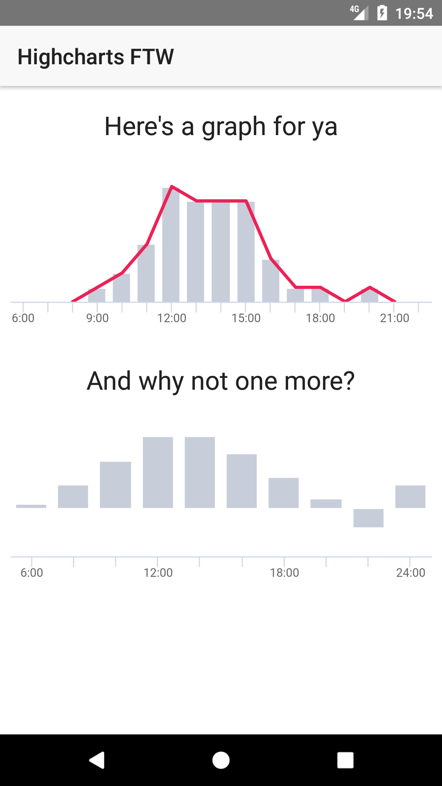

[NativeScript](https://www.nativescript.org/) + [Highcharts](https://www.highcharts.com/) = 💖
================================================

Just gaze with awe at the [source code](app/item) that renders these graphs on iOS (left) and Android (right):

 

### Running this demo
```bash
git clone https://github.com/EddyVerbruggen/nativescripthighcharts
cd nativescripthighcharts
tns run [ios|android]
```

### Steps to add Highcharts to your own app
* [Pick a chart type](https://www.highcharts.com/demo)
* [Tweak to your liking](http://api.highcharts.com/highcharts)
* From the above pages start a fiddle, [like I did for this demo](http://jsfiddle.net/y4tv0hkr/5/).
* Download highcharts.js and [ship it with your app](app/item/graph/js).
* Add you fiddle code to [the webview's html file](app/item/graph/graph.html). You can use this demo's html file as a template.
* [Add a `WebView` to your view](https://github.com/EddyVerbruggen/nativescripthighcharts/blob/18f4799f2a7e2b83c16e7ef77336099a06428acf/app/item/items.component.html#L6).
* [Wire it in your Component](app/item/items.component.ts) (Angular demo, but you get the idea).
* You can [parameterize the JS snippet in your webview](https://github.com/EddyVerbruggen/nativescripthighcharts/blob/18f4799f2a7e2b83c16e7ef77336099a06428acf/app/item/graph/graph.html#L43) and [pass the data from your Angular component](https://github.com/EddyVerbruggen/nativescripthighcharts/blob/18f4799f2a7e2b83c16e7ef77336099a06428acf/app/item/items.component.ts#L20). 
